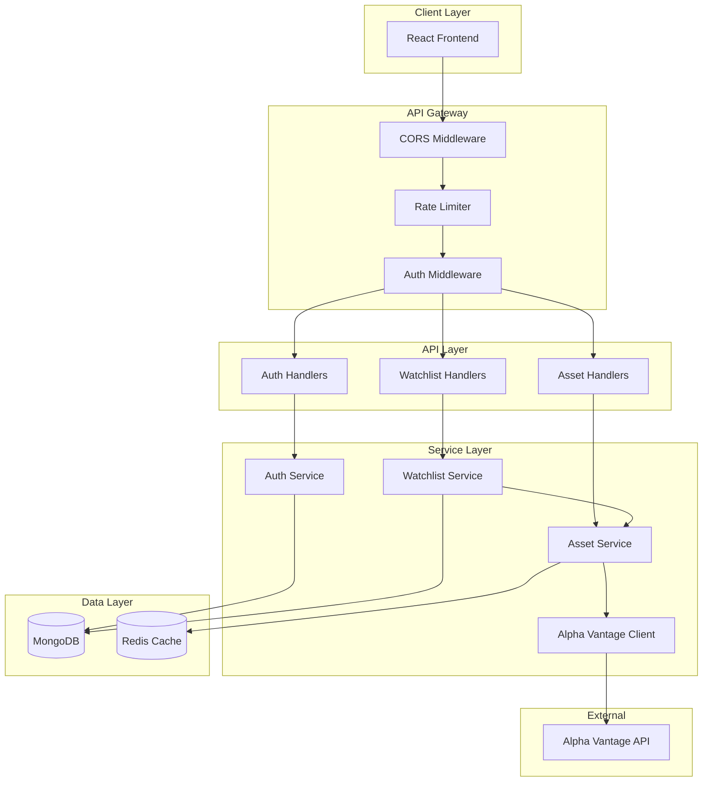
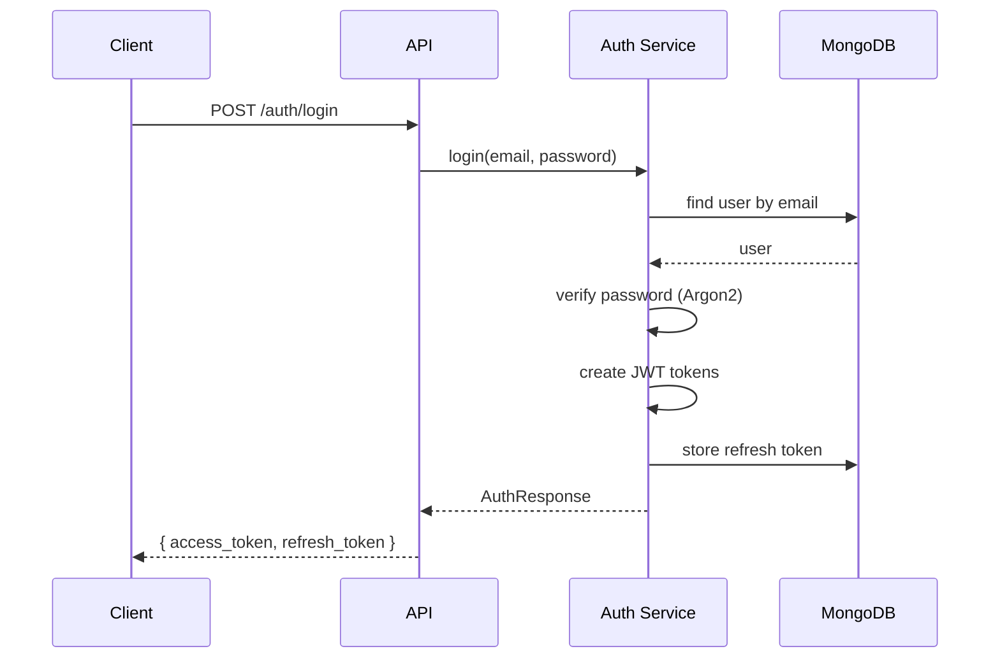
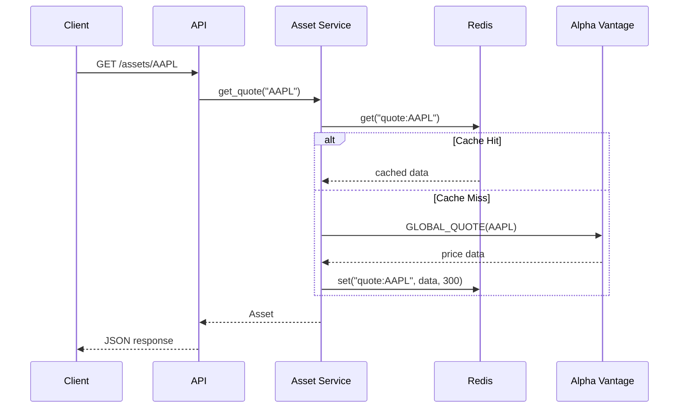

# Backend Architecture - Phase 1 MVP

This document describes the architecture of the My-Invest backend for Phase 1 MVP.

## Overview

The backend is built with Rust using the Axum web framework. It provides a RESTful API for user authentication, stock data retrieval, and watchlist management.

## Architecture Diagram



## Component Details

### API Layer

The API layer handles HTTP requests and responses.

#### Routes

```
/api/v1
  /auth
    POST /register          # User registration
    POST /login             # User login
    POST /logout            # User logout
    POST /refresh           # Token refresh
    GET  /me                # Current user info
  /assets
    GET /search?q=          # Stock search
    GET /:symbol            # Current price
    GET /:symbol/history    # Historical data
    POST /:symbol/refresh   # Force cache refresh
  /watchlists
    GET /                   # List watchlists
    POST /                  # Create watchlist
    GET /:id                # Get watchlist
    PUT /:id                # Update watchlist
    DELETE /:id             # Delete watchlist
    POST /:id/assets        # Add asset
    DELETE /:id/assets/:sym # Remove asset
```

#### Middleware Stack

1. **CORS** - Handles cross-origin requests
2. **Rate Limiter** - Limits requests per user (100/min)
3. **Auth Middleware** - Validates JWT tokens

### Service Layer

#### Auth Service

Handles user authentication:
- User registration with email/password
- Password hashing with Argon2
- JWT token creation and validation
- Refresh token management

```rust
pub struct AuthService {
    users: Collection<User>,
    refresh_tokens: Collection<RefreshToken>,
    jwt: JwtManager,
}
```

#### Asset Service

Manages stock data with caching:
- Stock search (via Alpha Vantage)
- Current price quotes
- Historical data (1D, 1W, 1M, 1Y)
- Redis caching (5-min quote TTL, 1-hour history TTL)

```rust
pub struct AssetService {
    alpha_vantage: AlphaVantageClient,
    redis: RedisDb,
    cache_ttl: u64,
}
```

#### Watchlist Service

Manages user watchlists:
- CRUD operations on watchlists
- Add/remove assets
- User data isolation

```rust
pub struct WatchlistService {
    watchlists: Collection<Watchlist>,
    asset_service: AssetService,
}
```

### Data Layer

#### MongoDB Collections

```
my_invest
├── users
│   ├── _id: ObjectId
│   ├── email: String (unique)
│   ├── password_hash: String
│   ├── created_at: DateTime
│   ├── updated_at: DateTime
│   └── preferences: Object
│
├── watchlists
│   ├── _id: ObjectId
│   ├── user_id: ObjectId
│   ├── name: String
│   ├── assets: Array<WatchlistAsset>
│   ├── created_at: DateTime
│   └── updated_at: DateTime
│
└── refresh_tokens
    ├── _id: ObjectId
    ├── user_id: ObjectId
    ├── token: String (unique)
    ├── expires_at: DateTime
    ├── created_at: DateTime
    └── revoked: Boolean
```

#### Redis Keys

```
search:{query}        # Search results (5-min TTL)
quote:{symbol}        # Current price (5-min TTL)
history:{symbol}:{tf} # Historical data (1-hour TTL)
```

## Request Flow

### Authentication Flow



### Asset Data Flow



## Security Considerations

### Authentication

- Passwords hashed with Argon2id (default parameters)
- JWT tokens with short expiration (1 hour access, 30 days refresh)
- Refresh tokens stored in database, can be revoked
- HTTPS required in production

### Authorization

- All protected routes require valid JWT
- User data isolation (user_id filtering)
- Watchlists only accessible by owner

### Rate Limiting

- 100 requests per minute per user
- Alpha Vantage: 5 requests/minute, 500/day (aggressive caching)

### Input Validation

- All inputs validated using `validator` crate
- Email format validation
- Password strength requirements
- Symbol format validation

## Error Handling

Custom `AppError` enum with proper HTTP status mapping:

| Error Type | HTTP Status |
|------------|-------------|
| ValidationError | 400 |
| InvalidCredentials | 401 |
| TokenExpired | 401 |
| NotFound | 404 |
| AlreadyExists | 409 |
| RateLimitExceeded | 429 |
| DatabaseError | 500 |
| ExternalApiError | 502 |

## Configuration

All configuration via environment variables:

```env
# Server
SERVER_HOST=0.0.0.0
SERVER_PORT=8080

# Database
MONGODB_URI=mongodb://localhost:27017
REDIS_URL=redis://localhost:6379

# Auth
JWT_SECRET=<secret>
JWT_ACCESS_EXPIRATION=3600

# External API
ALPHA_VANTAGE_API_KEY=<key>
```

## Scalability

### Current Design (Phase 1)

- Single server deployment
- MongoDB connection pooling
- Redis for caching and session management
- Stateless API (JWT-based auth)

### Future Considerations (Phase 2+)

- Horizontal scaling with load balancer
- MongoDB replica set
- Redis cluster or managed service
- WebSocket for real-time updates
- Background job processing for alerts

## Monitoring

### Logging

- Structured JSON logging in production
- Request/response logging with tracing
- Error logging with stack traces

### Health Checks

- `/health` endpoint for load balancer
- Database connectivity checks
- Redis connectivity checks

## Phase 1 Limitations

The following are out of scope for Phase 1:

- Crypto, ETF, Bond support (stocks only)
- Real-time WebSocket updates
- Price alerts
- Pattern detection
- Email notifications
- Password reset (stub only)
- Auto-refresh (manual only)

These features will be added in Phase 2 and beyond.
